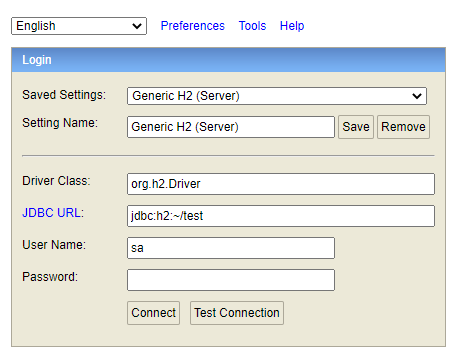
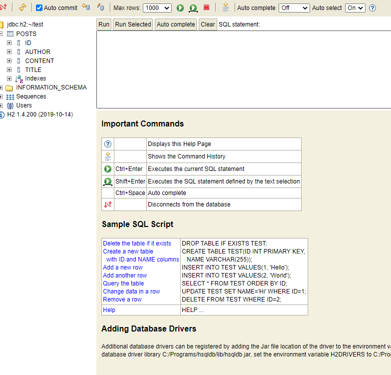

# Abstract

This is an integration with JPA.
WIP...

# Materials

* [Spring Boot With H2 Database @ baeldung](https://www.baeldung.com/spring-boot-h2-database)
* [Transactions with Spring and JPA @ baeldung](https://www.baeldung.com/transaction-configuration-with-jpa-and-spring)

# How to login to h2 console

* Open browser `http://localhost:8080/h2` after deploy the application.

